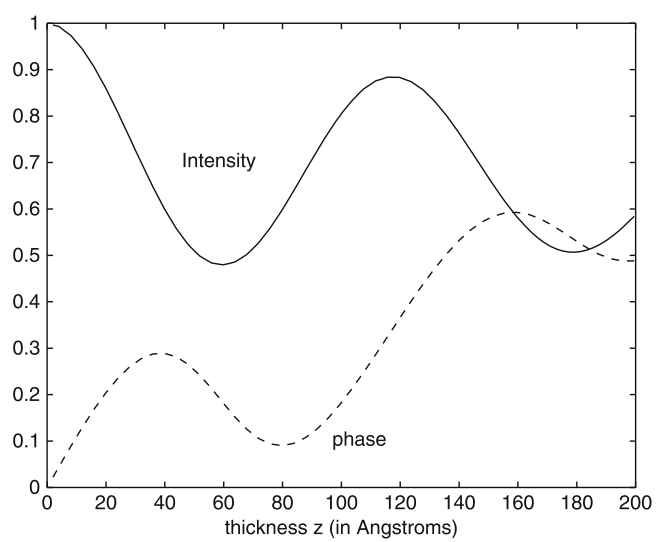

# Multislice Simulation

## Overview

**A method used to determine the exit wave function(exit image) of an incident electron beam by solving  Schrodinger's equation. The diffraction pattern is obtained as the Fourier transform of the exit image.**

### Links
  - [Wikipedia](https://en.wikipedia.org/wiki/Multislice) :
    A general overview.
  - [Cowley&Moodie, 1957](/articles/CowleyMoodie1957.pdf) :
    original paper with in-depth analysis of the method.
  - [Kirkland, 2010](/readings/Kirkland2010) :
    *Advanced computing in electron microscopy, 2010*
    is the main book reference for the implementation of the method available in the [TEMSIM package](#https://github.com/jhgorse/kirkland/tree/master/temsim).
  - [TEMSIM walk through](/projects/multislice/temsim) of the source code.
  - [opensource softwares](/notes/multislice_EM_softwares) :
    Other available opensource implementations of multislice.

### Assumptions and features
- Scattering is accounted for through the **interacting electronic potential $\varphi(x,y,z)$** so that the **electrons in the incident beam accelerated at potential $W_0$** have energies $W_0+\varphi$.
- **Dynamical diffraction** is naturally account for with this approach.
- **Inelastic scattering** is accounted for through the imaginary part of
the potential which is also denoted as *inelastic density function $\chi$*.
- The sample is divided in a series of slices orthogonal to the electrons propagation direction.
- Schrodinger's equation is solved by propagating the output wave function from one slice to the other using the **parabolic approximation(Fresnel diffraction)**.
- The potential plays a similar role in Schrodinger's equation as the atomic susceptibility of a medium in response to an incident electromagnetic wave in Maxwell's equation.
- Since typically $L/\lambda \approx 10^6$ with $L^3$ the crystal volume, it is impractical to attempt solving the wave equation with a
standard beam propagation method(BPM) and even less with a eigen value
solver.

## Method

The multislice approach solves the [fast electron Schrodinger's equation](/readings/Kirkland2010/#fast-electron-wave-equation) in real space by direct integration along $z$ (incident beam direction) :
\begin{equation}
  \Psi(z+\Delta z) = \Psi(z)e^{i\lambda/4\pi\Delta z\grad^2_{xy}
      + i\sigma\nu_{\Delta z}(x,y,z)}
\end{equation}
where $\nu_{\Delta_z}=\int_z^{z+\Delta z}V(x,y,z^{'})dz^{'}$ and $\sigma$ is the interaction parameter. Note that by neglecting the second order derivative of the envelope function, this equation assumes that the potential is small compared to the incident beam energy.

Due to the exponentiation operator this must be approximated as :
\begin{equation}
  \Psi(z+\Delta z) = p(x,y,\Delta z)\ast \Big(t(x,y,z)\Psi(z)\Big) +\mathcal O(\Delta z^2\nu_{\Delta z})
\end{equation}

where $t(x,y,z)=e^{i\sigma/4\pi\nu_{\Delta z}}$ is the transmission function, $p(x,y,\Delta z)\ast = e^{i\lambda/4\pi\Delta z\grad^2_{xy}}$ is the propagator operator with $p(x,y,\Delta z)=\frac{1}{i\lambda\Delta z}e^{ik_0\frac{x^2+y^2}{2\Delta z}}$ the **Fresnel propagator** function.

### Interaction parameter

The interaction parameter $\sigma=2\pi me\lambda/h^2$ is expressed in $rad/kV.A$, where $\lambda$ is the incident wavelength, and $m=\gamma m_e$ is the relativistic mass with the Lorentz factor $\gamma=1+E_0/m_ec^2$ and $E_0$ the accelerating voltage energy.

It depends on the electron wavelength only and tends to the non relativistic case $\sigma=\pi/\lambda_0E_0$ for small energy. This approximation is not valid at energies above $50keV$.

### Kinematic limit

If the specimen thickness is small the exponential transmission function can be approximated as $t(x,y,z)\approx 1+i\sigma\nu_{\Delta z}$.
Far from the slice, the convolution with the propagator reduces to
$e^{ik_0(x^2+y^2)/2}\mathcal F_{\perp}$
where $\mathcal F_{\perp}$ is the transverse Fourier transform.
Using the whole sample for the slice thickness and
$\Psi_0(x,y,z)=\Psi_0e^{-ik_0z}\underset{z=0}{=}\Psi_0$
gives the diffraction pattern as :
\begin{equation}
  \Psi(x,y) = \Psi_0\frac{e^{ik_0\frac{x^2+y^2}{2\Delta z}}}{i\lambda\Delta z}
    \left(\delta(0,0) + i\sigma
      \mathcal F^{2D}_{k_0x,k_0y}\Big\{\int_0^t V(x',y',z')dz' \Big\}
    \right)
\end{equation}

where $\mathcal F^{2D}_{k_0x,k_0y}\Big\{\int_0^t V(x',y',z')dz'\Big\}=\mathcal F^{3D}(k_x,k_y,0)$ from the [Fourier Projection Theorem](/books/kirkland2010/apxB-projectedPotential.pdf).
therefore corresponding to the kinematic scattering limit case.
The notion of projected potential being also mentioned in [zou, 2011](/readings/zou2011/#chap-3-crystal-structure-factors-and-symmetry).

The kinematic limit for which the slices are not interacting with one another also corresponds to the [phase grating approximation](/readings/Kirkland2010/#chap5-thin-specimens) approximation.

### Fresnel propagator vs Fraunhofer diffraction

Below, a great visual comparison between Fresnel(used in multislice) and Fraunhofer(used in kinematic approximation) diffractions from
[Jacopo Bertolotti](https://twitter.com/j_bertolotti/status/1199661806538633216) and a comparison with values that are relevant for electron diffraction.

Fresnel vs Fraunhofer  | relevant values for ED
---------------------- | ----
 | 

### Element of theory from Cowley & Moodie

See paper summary of [Cowley&Moodie,1957](/readings/papers#CowleyMoodie1957).

## Practical aspects

### Slicing

- The atoms should be aligned at the beginning of the slices so that the potential has effect only over a small fraction $\Delta z_a$ of the slice allowing cascading of the propagator therefore reducing error on the order of $\Delta z_a$
<!-- (**figure on the left**). -->
- Too large slice thickness can produce artefacts
- Slice can not be arbitrarily small as they need to cover the full range of the atomic potential $\simeq 1A$ which might not be small enough for large atomic numbers of low voltages.

### Bandwidth
- The potential must have rotational bandwidth-limited symmetry in reciprocal space.
 <!-- (**figure on the right**). -->

- Individual components of the multislice approach are nearly exact when taken individually. The main source of errors comes from the combination of propagating (Fresnel approximation) and transmitting (phase grating approximation).
- The Fourier transform of bandwidth limited product of $\Psi(\bb x)$ with $t(\bb x)$ is a convolution in reciprocal space $\Psi(\bb k)\ast T(\bb k)$. This is equivalent to successively sliding the Fourier transform of the transmission function $T(\bb k)$ along the fourier transform of the wave function $\Psi(\bb k)$. This causes aliasing if the full bandwidth is used (**left fig**). The remedy is to set $BW=2/3k_{max}$ (**right fig**). As a result only about 1/3 of the Fourier coefficients are used in practice.

### TEMSIM source code
- [TEMSIM source code walk through](/projects/multislice/temsim).

## Application examples

### GaAs
**Slicing**

Cubic Face-centred zincblende structure with $a=5.65A$ lattice constant
with slice unit cell $a_0\times b_0$ where $a_0=5.65/\sqrt 2=3.995A$, $b_0=a=5.65A$ and slices are $c_{z,j}=a\sqrt 2/4=1.998A$ thick each.

Structure | Slices [110] | Coords
----------|--------------|-------
 |  | 

**Sampling**

- The number of Fourier components $N\times N$ (where $N=2^{N_F}$) controls the accuracy of the simulation. While $128\times 128$ components seems enough for $50A$ thickness, it must be increased to $512\times 512$ for $200A$ thickness.
- The real space domain is represented by a supercell $A_0\times B_0$  composed of $N_a\times N_b$ unit cells such that $A_0=N_a a_0$, $N_b=N_b b_0$. The supercell size is increased to increase reciprocal space sampling $dq=1/max(A_0,B_0)$. The angular spacing $d\theta=\lambda dq\approx 1 mrad$ at $200keV$ and $A_0\approx 20A$.
- Increasing the resolution comes at the cost of a reduced bandwidth $q_{max}=\frac{2}{3}\frac{N}{2}dq$

**Dynamical scattering**

- Dynamical scattering appears as oscillating intensities as a function of thickness.
- $As$ atoms scatter more strongly which results in fainter signal at the exit image than $Ga$ atoms.

$I_{00}(T)$   | $I(x,y)$ at $T=200A$  | effect of microscope
----------    |--------------         |-------
 |  | 

###Silicon nitride

$\beta-Si_3N_4$ hexagonal [structure](https://www.materialsproject.org/materials/mp-988/) with $a=7.606A$ lattice constant
with 14 atoms per unit cell ($Si_6N_8$) with rectangular super unit cell $a_0\times b_0$ where $a_0=7.606A$ and $b_0=13.174A$ each with thickness $c_z=1.4545A$.

Structure N(white), Si(black) | Slices [001] | Exit image magnitude
------------------------------|--------------|----------------------
 |  | 
