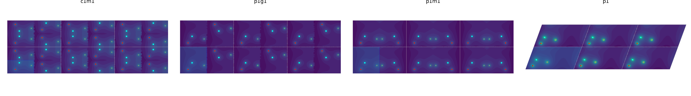
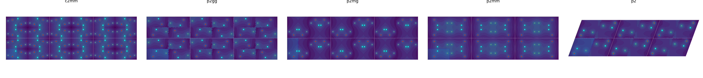
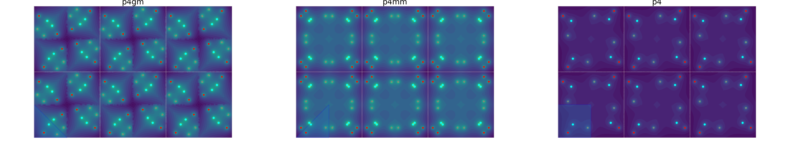
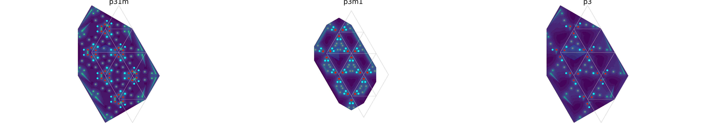
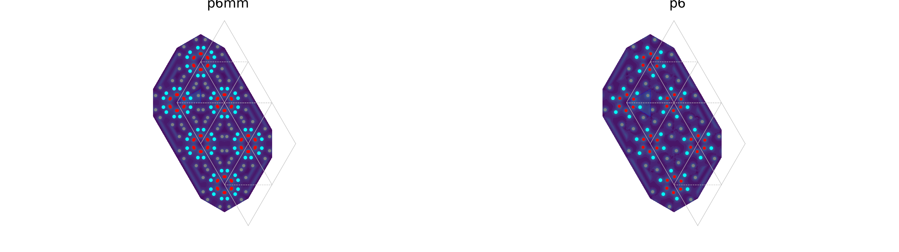

# Wallpapers library

This is a library to generate wallpapers based on a pattern provided through the file *pattern.txt* or a simple numpy array.

## Basic use
```
import wallpp.plane_group as pg
pattern = np.array([[0.25,0.25,2], [0.5,0.5,3]])
p4=pg.Wallpaper('p4',a=1,pattern=pattern,gen=True,ndeg=3,nh=2,nk=2,pOpt='p')
```

- *p4* contains potential and atoms locations in the extended zone.
- pattern must have format : $x_i,y_i,Z_i$ where $x_i,y_i$ are the normalized coordinates and $Z_i$ is the atomic number of atom $i$.

## Modules
See documentation of the modules of this python package :

- [lattice](lattice)
- [plane group](plane_group)


##Gallery
The 17 plane groups are defined in the International table.
Below the generated wallpapers from a given pattern (asymmetric unit cell
corresponds to the blue patch) :

- [p1](figures/p1.png),[p1m1](figures/p1m1.png),[p1g1](figures/p1g1.png), [c1m1](figures/c1m1.png)

- [p2](figures/p2.png),[c2mm](figures/c2mm.png),[p2mm](figures/p2mm.png),[p2mg](figures/p2mg.png),[p2gg](figures/p2gg.png)

- [p4](figures/p4.png), [p4mm](figures/p4mm.png), [p4gm](figures/p4gm.png)

- [p3](figures/p3.png), [p31m](figures/p31m.png), [p31m](figures/p31m.png)

- [p6](figures/p6.png), [p6mm](figures/p6mm.png)

